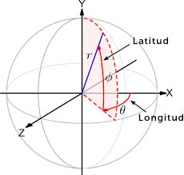

# Ejercicios de Matemáticas en Unity

## Instrucciones (Léelas atentamente)
Todo el material necesario para realizar los ejercicios de cada sección estarán dentro de la carpeta de Assets del proyecto de Unity con el nombre de la sección. Para empezar a realizar los ejercicios de una sección pincha en el título, es un enlace de descarga.

Para empezar:
1. Cada ejercicio deberá completarse en una escena diferente en la carpeta Scenes del proyecto, dentro de Assets. Para el primer ejercicio de la sección Vectores deberás llamar a la escena *Vectores01*, para el segundo, *Vectores02*, ...
2. Dentro de cada escena crea un gameobject vacío para colocar el script en el que vas a trabajar. Nombra al gameobject con el nombre de la sección y el número del ejercicio: *Vectores_01*, *Vectores_02*, etc.
3. Con el script de cada ejercicio haremos algo parecido. Crea el script dentro de la carpeta Scripts, dentro de Assets y nómbralo siguiendo el patrón: `Vectores01`, `Vectores02`, etc. 

En los primeros ejercicios tendrás la escena, el gameobject y el script ya creados para ayudarte, pero después tendrás que hacerlo tú. 

Lee bien el enunciado de cada ejercicio, en algunos casos puede darte instrucciones diferentes.

No toques lo que hay en el resto de carpetas del proyecto, salvo que te lo pida el enunciado del ejercicio. En algunos ejercicios hay ejemplos o código adicional que debes respetar si quieres que funcione todo correctamente cuando termines el ejercicio.

Para evitar sustos, te recomiendo que cada vez que termines un ejercicio hagas una copia de seguridad del proyecto, siguiendo [estos pasos](#copias-de-seguridad-volver-al-inicio):

Tú eres responsable de hacer copias de seguridad de tus archivos, en ningún caso un problema con el ordenador servirá de excusa para no realizar una entrega.


## Vectores

Los primeros ejercicios son para desarrollar la intuición sobre el sistema de coordenadas de Unity. Aunque me he preocupado de hacerlo difícil (para evitar tentaciones), siempre es posible hacer trampas para terminar los ejercicios rápido. Pero recuerda que la idea es que los ejercicios tienen un objetivo didáctico. Tenerlos terminados sin aprender no sirve de nada.  
 
**Entrega 1**

1.   Posiciona cada cubo en su marcador correspondiente usando vectores 
y teniendo en cuenta que el marcador X se encuentra en el origen de coordenadas. 
Si la tienes desactivada, no olvides activar la rejilla de escena en *Guizmos* -> *Show Grid*, para que puedas estimar la posición de los marcadores con un mínimo de exactitud.
Utiliza la función `Start()` y las variables que ya están definidas e inicializadas en el script `Vectores01` que está como componente del gameobject *Vectores_01*.
>  Ejemplo:
  ```cs
cube_3.transform.position = new Vector3 (1, 0, 3);
```
Tambien lo puedes hacer así:
  ```cs
cube_3.transform.position = 1F*Vector3.right + 3F*Vector3.forward;
```
Usando los vectores unidad en las direcciones de los ejes: 
>&nbsp;&nbsp;&nbsp;&nbsp;   x -> Vector3.right 
>&nbsp;&nbsp;&nbsp;&nbsp;   y -> Vector3.up 
>&nbsp;&nbsp;&nbsp;&nbsp;   z -> Vector3.forward 
Te recomiendo que lo hagas de las dos maneras por que dependiendo de la situación 
es más cómodo usar una o otra de las formas.
> **A recordar**: Al vector que va del origen de coordenadas a la posición un objecto se le llama ***vector posición*** del objeto.  

2.  Haz como en el ejercicio anterior, pero en la escena *Vectores02*. Ahora entra en juego la coordenada y.
> Esta vez crea tú el script `Vectores02` fijándote en como está hecho en el ejercicio anterior, y coócaselo como componente al gameobject *Vectores_02*. <br><br>

3.  En este ejercicio tienes que hace que el cubo marcado con la X se de un punto a otro de la ruta marcada en el suelo. El cubo tiene un script con una función (`mover`) que permite hacer que se mueva con velocidad constante dándole como parámetro el vector de desplazamiento<sup>(1)</sup> como se ve en este ejemplo: <br><br>
  
  ```cs
  void Start() {
      mover.SetInitialPosition(new Vector3(4, 0, -4));  // 1º fijamos la posición inicial del cubo.
	  mover.Move(-2 * Vector3.right); // Ordenamos al cubo que se mueva al punto 1 azul
	  mover.Move(5 * Vector3.forward); // Ordenamos al cubo que se mueva al punto 2 azul.
}
  ```
  > <sup>(1)</sup> El ***vector desplazamiento*** es el vector que va desde donde esté el cubo hasta el lugar donde tiene que moverse.
  > **Aclaración**: La función `Move()` no existe como tal en Unity. Es una función que he creado para estos ejercicios para que no te tengas que preocupar de nada más que de averiguar los vectores de desplazamiento.

4.  Utilizando la misma técnica que en el ejercicio anterior mueve el cubo X de un vértice a otro del paralelepípedo grande que hay en la escena siguiendo el orden indicado por los marcadores y empezando en la X. 
Crea tú el gameobject *Vectores_04* para el script y el script `Vectores04`, fijándote en cómo está hecho en el ejercicio anterior.
> Fíjate en que la textura del cubo tiene una rejilla: Las líneas más marcadas están separadas un metro entre sí. 

5.   En la escena Vectores05 haz que el cubo x se mueva por la superficie o las aristas del bloque pasando por todas las esferas en el orden que quieras. Crea tú el script y el gameobject en el que adjuntarlo como componente. La posición de comienzo del camino debe ser la misma en la que se encuentra el cubo al inicio.  <br><br><br><br>
  
 ---
  
  En muchos juegos el contenido de un nivel se genera al vuelo. En lugar de diseñar el escenario al completo en un Maya o similar y cargarlo entero se diseñan piezas modulares y se genera el nivel colocando esas piezas con cierta aleatoriedad o en un orden prefijado en un archivo de texto que sirve de mapa para generar el escenario. Esto tiene, entre otras ventajas, que la carga de cada nivel es mucho más rápida y que ocupamos menos memoria. 
  El siguiente bloque de ejercicios trabaja algunas de esta técnicas a un nivel muy básico, usando bucles condicionales y vectores para generar geometría más o menos compleja a partir de prefabs.   

   ---

6.   Utilizando el prefab *cubePrefab*, genera una fila de 20 cubos consecutivos en la dirección x, empezando en la posición (-10, 0, 0)
	* Abre la escena Vectores06. 
    * Crea un gameobject vacío y llámalo *Vectores_06*.
	* Crea el script `Vectores06` en la carpeta de scripts y escribe el código del ejercicio en él. 
	* En el bucle utiliza `GameObject.Instantiate()`<sup>(2)</sup> para crear clones del prefab.
	* Tendrás que calcular la coordenada x del vector de posición de cada cubo utilizando una fórmula muy simple utilizando el contador del bucle como variable.  
  	
	><sup>(2)</sup> Fíjate en que en la ayuda de Unity para muchas funciones aparecen varias versiones de la misma función con distintos parámetros. Eso significa que podemos utilizar la que más nos guste o convenga en cada momento.
  En este caso vamos a utilizar la primera.  
	```cs
	public GameObject cubePrefab;
	//...
	void Start() {
		//...
		GameObject cubeInstance = Object.Instantiate(cubePrefab);
		cubeInstance.transform.position = ...
		//...
	} 
    ```
	**Cuidado**: Los ejemplos de la página de Unity no siempre son muy claros y es fácil que te confundan si no entiendes bien la diferencia entre lo que hacen y lo que tú quieres hacer.
7.  Repite el ejercicio anterior pero genera la fila de cubos en la dirección z. Haz que empiece en la posición (-10, 0, 0).
  
  > A partir de ahora, aunque no se mencione en el enunciado, para cada ejercicio debes crear una nueva escena, con el nombre del tema seguido del número de ejercicio (en este caso será: Vectores07) y su correspondiente gameobject con el mismo nombre para colocar el script del ejercicio (también con el mismo nombre).
  
8. Te habrás fijado que aún colocando el primer cubo en las posiciones indicadas en los dos ejercicios anteriores, las filas de cubos no quedan como se indica en la escena. 
	1. ¿Por qué crees que es esto?
	2. Modifica los programas para que tus filas queden alineadas con las de muestra en ambas escenas.
	2. ¿Por qué si pinchas en el primer cubo de la fila que viene en la escena para indicarte como debe quedar, las coordenadas que aparecen en el componente *transform* no tienen nada que ver con las que te indico en el enunciado?<br>    


9.   RETO: Haz una fila de cubos en diagonal utilizando el mismo prefab, sin modificar, que en los ejercicios anteriores. Hay varias formas. Una de ellas es rotar cada instancia del cubo y usar la propiedad `normalized` de los vectores al colocarlo. ¿Se te ocurre alguna otra?  <br><br><br>

10. Rehaz el ejercicio 5, pero esta vez configurando los movimientos desde el editor en un array de Vector3. Para ello, debes crear un nuevo script Vectores10. Este script debe exponer una variable llamada ```movements``` que permita configurar un array de puntos desde el editor de Unity. Después, en el Start, tras introducir la misma posición de inicio que en el ejercicio 5 original, usa un loop para leer los valores de ```movements``` y asignarlos como siguiente movimiento: ```mover.Move(nextMovement);```.

    > Deberás duplicar la escena y renombrarla *Vectores10*, y en esta nueva escena cambiar y configurar el nuevo script para poder hacer pruebas.

    > Para acceder al array usa una variable índice, recorriendo cada posición del array hasta llegar al final. Recuerda que el número de elementos en un array viene dado por ```movements.Length``` y que el primer elemento está en la posición ```movements[0]```.<br>
  
11. Repite los ejercicios 6 y 7 dejando 2, y 3 espacios entre los cubos, respectivamente. (Nombra las escenas, gameobjects y escripts añadiéndoles _6 y _7 respectivamente. Por ejemplo: *Vectores11_6*)

12. Construye una escalera de cubos, usando el prefab de los ejercicios anteriores. No modifiques el prefab. 

13. Construye una escalera de nuevo, pero alternando clones del prefab *dark_stairstep* y *light_stairstep*. No modifiques los prefabs.

 > Podrías hacerlo utilizando dos bucles (hazlo así primero, si quieres), pero es más corto hacerlo si recuerdas o aprendes a usar el operador módulo: `%`. 
 > La expresión:  
 ```cs 
  int resto = 7 % 2;
  ```
 > Devuelve el resto de la división entera de `7` entre `2`. Es decir, el resultado de la división sería `3`, dejando un resto de `1`. O sea que `resto` tendría el valor `1`. Utilizando este operador en un condicional puedes averiguar si estás en un escalón par o impar, y crear la copia del prefab que corresponda.
 
14. Construye una escalera de cubos dejando descansillos (con instancias del prefab *stairlanding*) cada 5 escalones. Aquí es fundamental que pienses bien como construir los condicionales.

15. Repite el ejercicio anterior, pero creando tú, tus propios prefabs de escalón y de descansillo<sup>(3)</sup> a  partir de la primitiva de un cubo  de Unity. Intenta usar el script del ejercicio anterior ¿Por qué no funciona bien tu script del ejercicio anterior?. Arregla el script para estos nuevos prefabs.
><sup>(3)</sup> Crea una carpeta Vectores15 en la capeta de Prefabs y coloca ahí los que crees para este ejercicio. Haz lo mismo en todos los ejercicios en los que necesites crear prefabs.

16. RETO: Crea una escalera como en los ejercicios anteriores, pero usa cn cubo normal como prefab, colocándolo y deformándolo como sea necesario para que la escalera suba 3 metros de altitud en una distancia de 4 metros de longitud, y tenga 15 escalones. Parametriza estas cantidades de forma que se puedan configurar desde el inspector

17. RETO: Escribe un script que cree una escalera en espiral que de dos vueltas. Puedes crearte los prefabs a medida, o utilizar un prefab de cubo normal y configurarlo desde el código para cada escalón ¿Qué es más fácil? Hazlo de las dos formas si puedes.  <br><br>
**Entrega 2**<br>
18. Ahora que te manejas mejor con los vectores vas a hacer que un gameobject se mueva con velocidad constante en la dirección x. Para eso tenemos que usar la función `Update()`. Lo que harás es actualizar la posición del gameobject basándote en el valor numérico de una propiedad que llamarás `v` (la velocidad) y que debes declarar como pública para que se pueda rellenar desde el inspector. La velocidad introducida se interpretará como que está en m/s.
En cada fotograma, a la posición actual del gameobject le sumarás su velocidad multiplicada por el tiempo transcurrido desde el ultimo *update* <sup>(4)</sup> en la dirección x. 
 ><sup>(4)</sup> Recuerda que en un movimiento rectilíneo y con velocidad uniforme 
 > *s = v·t*
 >donde *s* es el espacio recorrido (o a recorrer), *v* es la velocidad y *t* el tiempo transcurrido.
 >Puedes leer el tiempo transcurrido desde el fotograma anterior con la propiedad `Time.deltaTime`.  

19. Repite el ejercicio anterior, pero en vez de mover el gameobject en la dirección x, haz que pase por una posición dada por un vector que se introduzca también en el inspector. 
Para evitar que la velocidad a la que se mueve el gameobject dependa de la longitud del vector introducido, normaliza el vector de dirección, utilizando su propiedad `normalized`, antes de multiplicar por la velocidad. Esto hará que ese vector conserve la dirección pero tenga longitud 1.
No asumas que el cubo está en la posición (0,0,0). El programa debe funcionar cuando el cubo esté en cualquier otra posición también.

20. RETO: Repite el ejercicio 18, pero en vez de utilizar un vector para indicar la dirección usa dos ángulos. Uno (de 0 a 360 grados) para el ángulo en el plano horizontal, y otro (de -90 a 90) para indicar la inclinación vertical (son la longitud y la latitud de los mapas cartográficos). <sup>5</sup>
>Tendrás que usar las funciones `Mathf.Sin()`, `Mathf.Cos()` y convertir los ángulos a radianes utilizando la propiedad `Mathf.DegToRad` (porque las funciones anteriores requieren que les pases el ángulo en radianes).
><sup>(5)</sup> Recuerda que Unity los ángulos se miden en el sentido de las manecillas del reloj.
>***Más información:***  *Estos dos ángulos, junto con la longitud del vector  son lo que se denomina sistema de coordenadas esféricas, mientras que el que usamos normalmente se denomina sistema cartesiano. <br>Ambos sistemas son válidos y útiles dependiendo de la situación, A pesar de que Unity use el sistema cartesiano para manejar vectores, en algunas mecánicas de juego nos puede interesar utilizar coordenadas polares, aunque después haya que convertirlas a cartesianas.*


21. Continúa el ejercicio 19 (copia la escena y el script y renombra para reflejar que es un nuevo ejercicio) y haz que el cubo se pare exactamente cuando llegue a la posición elegida.
> Pista: Es prácticamente imposible que la posición del cubo sea exactamente igual a la posición 1 a lo largo del movimiento, así que piensa bien como escribir la condicional y que hacer para que se para allí sin pasarse. 
 

22. Repite el ejercicio anterior pero de forma que se pueda modificar la posición de destino arrastrando un gameobject (que marca la posición de destino) una propiedad que se llame `destino`.


23. Toma la escena de le ejercicio 1 y renómbrala a *Vectores23*. Borra el gameobject *Vectores_01*. Adapta el script del ejercicio 22 para que se pueda poner como componente a cada uno de los cubos y que arrastrando el punto de destino de cada uno en el inspector los mueva a sus marcadores en el suelo con velocidad constante y parándose al llegar al destino.

24. Crea una nueva escena. Crea una esfera en la jerarquía. Haz que se mueva con velocidad constante pero aleatoria (con magnitud entre 1 y 4 m/s) en cualquier dirección también aleatoria. El script debe estar añadido como componente de la esfera.

25. Repite el ejercicio anterior y haz que un script externo (en el gameobject vacío *Vectores_25*) mida el vector velocidad de la esfera y lo muestre en la consola.  
Debes hacer que el script lea la posición de la esfera en dos fotogramas consecutivos y calcule el vector distancia entre ellos. Usando el tiempo transcurrido entre los dos fotogramas, es fácil calcular la velocidad. 
> No vale leer directamente la propiedad velocidad de la esfera (en caso de que sepas como hacer esto)  
> Normalmente no es una buena idea medir la velocidad entre el primer y segundo programa, porque Unity realiza un montón de tareas internas al iniciarse y la velocidad medida no es entre esos dos fotogramas no es fiable. Espera por lo menos al segundo fotograma para tomar la primera posición de la medida.

27. Copia la escena del ejercicio anterior. Crea en ella un cubo y crea un script que, usando la magnitud de la velocidad medida haga que el cubo persiga a la esfera. Asegúrate de que el cubo persigue a la esfera desde cualquier posición de la escena.

29. Repite el ejercicio anterior pero de forma que el cubo alcance a la esfera y los dos se paren en ese momento.


## Apéndices

### Copias de seguridad (<small>[Volver al inicio](#instrucciones-l%C3%A9elas-atentamente))
Para evitar sustos, te recomiendo que cada vez que termines un ejercicio hagas una copia de seguridad del proyecto, siguiendo estos pasos:

1. Cierra Unity (IMPORTANTE)
2. Ve a la carpeta del proyecto y borra todas las subcarpetas menos *Assets* y *ProjectSettings*
3. Comprime la carpeta del proyecto.
4. Nombra el archivo comprimido con el nombre de la sección de ejercicios y el número del último ejercicio terminado: `Vectores01.7z`, `Vectores02.7z`, etc. 
Si haces copias de seguridad parciales añade un número de versión al nombre, separándolo con un guión bajo (`_`): `Vectores07_v1.7z`, `Vectores07_v2.7z`, ...


Tú eres responsable de hacer copias de seguridad de tus archivos, en ningún caso un problema con el ordenador servirá de excusa para no realizar una entrega.
